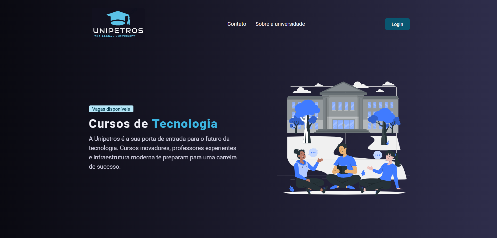
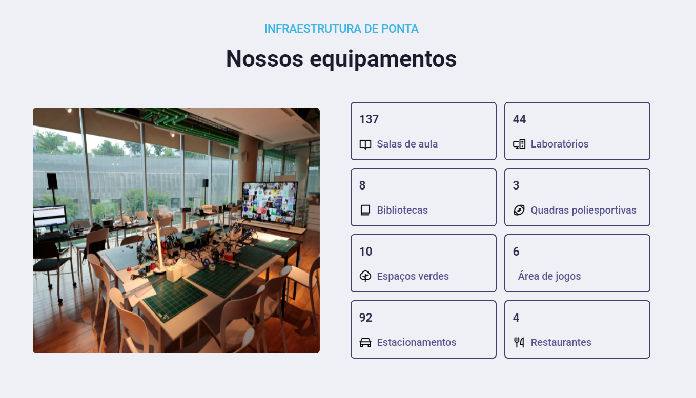
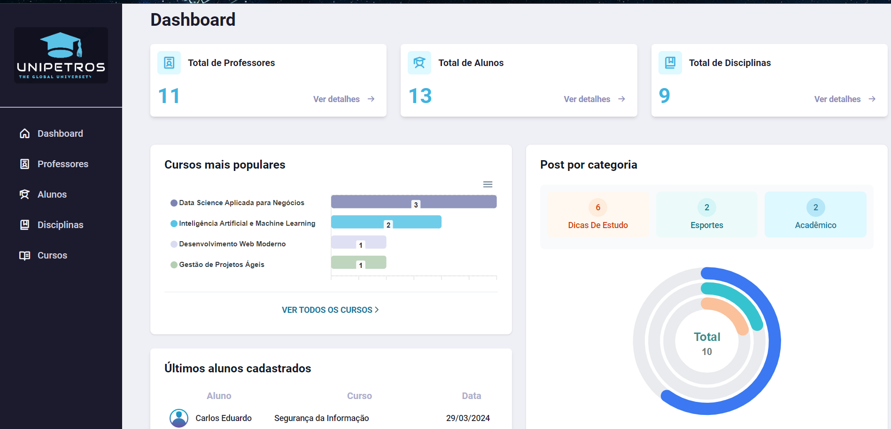
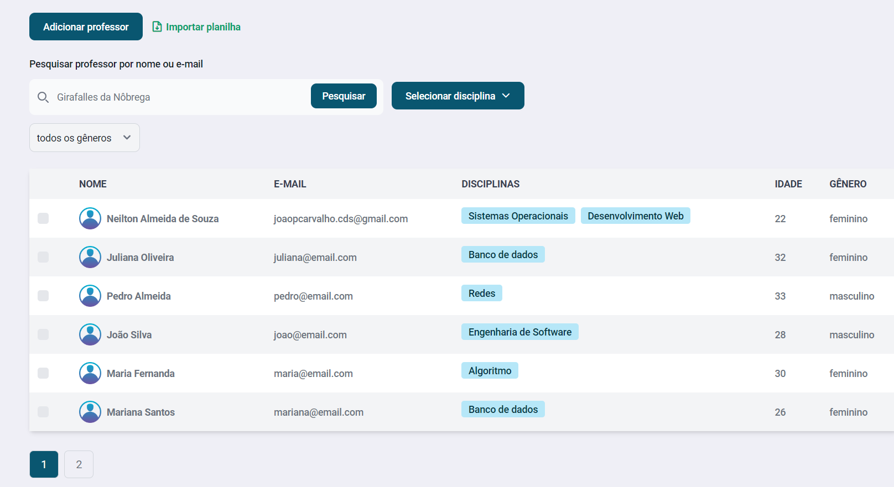

<h1 align="center">
  Unipetros 🎓
</h1>

<div align="center">
   <a href="https://github.com/JohnPetros">
      
   </a>
   
   <a href="https://github.com/JohnPetros/unipetros/commits/main">
      
   </a>
  </a>
   </a>
   <a href="https://github.com/JohnPetros/unipetros/blob/main/LICENSE.md">
      
   </a>
    
</div>
<br>

## 🖥️ Sobre o Projeto

**Unipetros** é um **site web** para um universidade fictícia do mesmo nome.

A aplicação possui duas sessões, uma voltada para a apresetação e descrição da universidade e outra para administrar dados pertinentes a uma instiuição de ensino, como cursos, dicisplinas, professores e alunos.

O objetivo ao realizar esse projeto foi aprender de forma avançanda o desensolvimento de aplicações web utilizando [Flask](https://flask.palletsprojects.com/en/3.0.x/), um framework [Python](https://www.python.org/), bem como trabalhar com [Docker containers](https://www.docker.com/resources/what-container/) personalizados utilizando [Docker hub](https://www.docker.com/) durante a disciplina de Sistemas Operacionais e Redes na [FATEC São José dos Santos](https://fatecsjc-prd.azurewebsites.net/).


### ⏹️ Demonstração

<table align="center">
  <tr>
    <td align="center" width="700">
    <span>Landing page<br/></span>
    
    </td>
  </tr>
   <tr>
    <td align="center" width="700">
    <span>Página de contato<br/></span>
    
    </td>
  </tr>
  <tr>
    <td align="center" width="700">
    <span>Página de sobre<br/></span>
    
    </td>
  </tr>
   <tr>
    <td align="center" width="700">
    <span>Página de dashboard<br/></span>
    
    </td>
  </tr>
   <tr>
    <td align="center" width="700">
    <span>Página de tabela<br/></span>
    
    </td>
  </tr>
</table>

---

## ✨ Funcionalidades

### Landing Page

- [x] A página inicial deve possuir estilo landing page para captar a atenção do usuário. 
- [x] Essa página deve possuir as sessões:
  - Vantagens de estudar na Unipetros
  - Depoimento de um aluno/aluna falando bem da Unipetros
  - Depoimento de um aluno/aluna falando bem da Unipetros
  - Últimos posts do blog fictício da Unipetros

### Página de contato
- [x] Deve haver um página contendo um formulário para o usuário entrar em contato com a Unipetros
- [X] Essa página deve exibir endereço, número de telefone e e-mail e um formulário de contato da Unipetros
- [x] O formulário deve conter
  - Nome do usuário
  - E-mail do usuário
  - Mensagem do usuário

### Página contando a história da Unipetros
- [x] Deve haver uma página que fale mais sobre a Unipetros
- [x] Essa página conter as sessões:
  - Um resumo da origem e fundação da Unipetros
  - Uma mapa indicando a localização da Unipetros
  - Dados a respeito da infraestrutura da Unipetros
  - Nome e descrição dos programas de extensão da Unipetros
  - Nome, cargo, local de trabalho e depoimento de ex-alunos da Unipetros

### Navegação
- [x] Deve haver links de acesso para qualquer uma das páginas do site

### Login
- [x] O usuário administrador deve fazer login para poder acessar o dashboard utilizando e-mail e senha
- [x] O usuário deve poder escolher manter ou não sua sessão mesmo que navegador venha a fechar
- [x] O sistema deve bloquear o acesso ao dashboard caso não haja uma sessão ativa
- [x] O sistema guardar a rota da página que o usuário não conseguiu acessar em um primeiro momento para que caso ele faça login ele seja redirecionado imediatamente para a página em questão 
- [x] O usuário deve poder fazer logout, ou seja, encerrar sua sessão

  
### Gráficos
- [x] O dashboard deve exibir gráficos de diversos formatos a respeito dos dados cadastrados no sistema
- [x] Deve gráfico que indique a quantidade matrículas por disciplina
- [x] Deve haver um gráfico que indique a quantidade posts por categoria de post
- [x] Deve haver um gráfico que indique a frequência dos alunos em um período de 7, 30 ou 90 dias (escolha do usuário) 
- [x] Deve haver um gráfico que indique a quantidade de alunos por gênero 
- [x] Deve haver um gráfico que indique a quantidade de professores por disciplina 
- [x] Deve haver um gráfico que indique a quantidade de matrículas ativas e desativadas em um período de 7, 30 ou 90 dias (escolha do usuário)

### Tabela de professores

- [x] Deve ser exibido uma tabela que contenha todos os professores de forma paginada
- [x] Cada linha dessa tabela deve exibir:
  - Avatar
  - Nome
  - E-mail
  - Disciplinas
  - Idade
  - Gênero
- [x] Deve ser possível filtrar professores por nome, email ou disciplina
- [x] Deve ser possível deletar um ou mais professors de uma vez
- [x] Deve ser possível adicionar um professor via formulário contendo os campos:
  - Nome
  - E-mail
  - Telefone
  - Data de nascimento
  - Gênero
  - Senha
  - Confirmação de senha
  - Avatar
  - Um ou mais disciplinas
- [x] Deve ser possível adicionar um professor via arquivo CSV, em cada uma das suas colunas corresponde a um campo do formulário citado no item anterior

### Página de professor

- [x] Deve haver uma página própria que exiba os dados do professor
- [x] Deve ser exibido o avatar de outros professores que também lecionam as mesma disciplinas que o professor em questão
- [x] Deve haver um formulário para editar qualquer dado do professors em questão

---

## ⚙️ Arquitetura

## 🛠️ Tecnologias, ferramentas e serviços externos

Este projeto foi desenvolvido usando as seguintes tecnologias:

✔️ **[Python](https://www.python.org/)** para programar o backend

✔️ **[Flask](https://flask.palletsprojects.com/en/3.0.x/)** Para servir como framework para construir o servidor web, fazer validação dos formulários e gerenciar a autenticação do usuário

✔️ **[MySQL](https://www.mysql.com/)** para ser banco de dados

✔️ **[HTML](https://developer.mozilla.org/pt-BR/docs/Web/HTML)** Para fazer a marcação das páginas do site

✔️ **[CSS](https://developer.mozilla.org/pt-BR/docs/Web/CSS)** - para estilizar os elementos do site

✔️ **[JavaScript](https://developer.mozilla.org/pt-BR/docs/Web/JavaScript)** - Para adicionar interatividade nos elementos do site

✔️ **[ApexCharts.js](https://apexcharts.com/)** - Para renderizar gráficos

✔️ **[Docker](https://www.docker.com/)** - para criar e gerenciar os containers da aplicação

> Para mais detalhes acerca das dependências do projeto, como versões específicas, veja o arquivo [package.json](https://github.com/JohnPetros/unipetros/blob/main/package.json)

---

## 🚀 Como rodar a aplicação?

### 🔧 Pré-requisitos

Antes de baixar o projeto você necessecitará ter instalado na sua máquina as seguintes ferramentas:

- [Git](https://git-scm.com/) para manilupar repostitórios Git
- [Docker](https://docs.docker.com/get-docker/) para manipular Docker containers

> Além disto é bom ter um editor para trabalhar com o código, como o [VSCode](https://code.visualstudio.com/)

> Além disto é crucial configurar as variáveis de ambiente em um arquivo chamado `.env` antes de executar a aplicação. veja o arquivo [.env.example](https://github.com/JohnPetros/unipetros/blob/main/.env.example) para ver quais variáveis devem ser configuradas

### 📟 Rodando a aplicação

```bash

# Clone este repositório
$ git clone https://github.com/JohnPetros/unipetros.git

# Acesse a pasta do projeto
$ cd unipetros

# Rode o container da aplicação
$ docker compose up

```

### 🧪 Rodando os testes

```bash
# Execute os testes
$ npm run test
# ou
$ yarn test
```

---

## 💪 Como contribuir

```bash

# Fork este repositório
$ git clone https://github.com/JohnPetros/unipetros.git

# Cria uma branch com a sua feature
$ git checkout -b minha-feature

# Commit suas mudanças:
$ git commit -m 'feat: Minha feature'

# Push sua branch:
$ git push origin minha-feature

```

> Você deve substituir 'minha-feature' pelo nome da feature que você está adicionando

> Você também pode abrir um [nova issue](https://github.com/JohnPetros/unipetros/issues) a respeito de algum problema, dúvida ou sugestão para o projeto. Ficarei feliz em poder ajudar, assim como melhorar este projeto

---

## 📝 Licença

Esta aplicação está sob licença do MIT. Consulte o [Arquivo de licença](LICENSE) para obter mais detalhes sobre.

---

<p align="center">
  Feito com 💜 por John Petros 👋🏻
</p>
